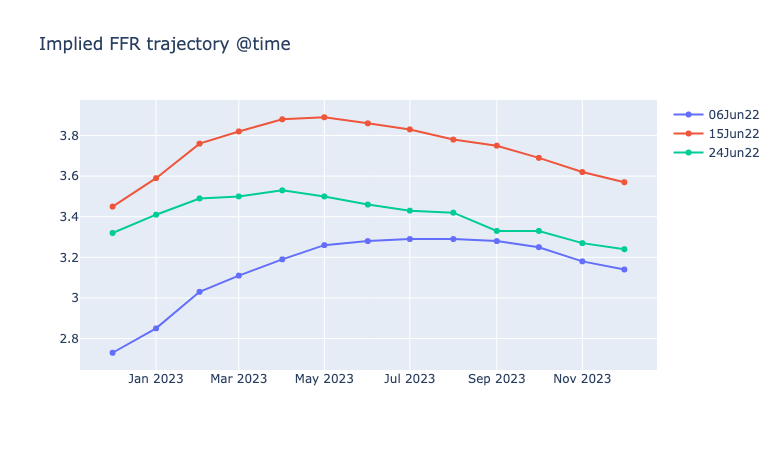
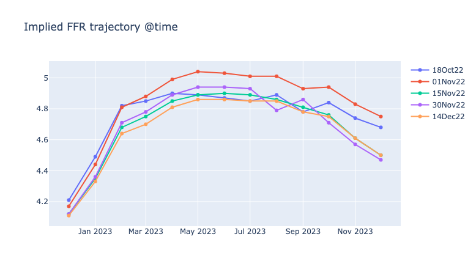

# Intro

## Idea 

In my Money and Banking class at the University of Minnesota, Terry Fitzgerald has shown us the [FedWatch tool by CME](https://www.cmegroup.com/markets/interest-rates/cme-fedwatch-tool.html). This tool shows the probability distribution of the implied FedFundsRate hikes before FOMC meetings. I wanted to replicate this, because it seemed interesting, looked at the [methodology](https://www.cmegroup.com/education/demos-and-tutorials/fed-funds-futures-probability-tree-calculator.html) and found out that CME is not upfront about how exactly they are getting the data. 

## Implementation 

Later on, I decided that it would be pretty convenient and cool to see how the implied trajectory of the fed funds rate changes over time. To do this I downloaded the futures historical prices from [yahoo finiance](https://finance.yahoo.com/quote/ZQ%3DF/futures?p=ZQ%3DF) using [yfinance](https://pypi.org/project/yfinance/), conducted some algebraic operations on the data and plotted the trajectories using [ploty](https://plotly.com). 

# Some Examples

>graphs.impl_exp("2022-06-05", "2022-06-30", 7)

>The command plots the implied trajectories of the fed funds from the June 5th to June 30th with a period of 7 days 
<

>graphs.impl_exp("2022-10-18", "2022-12-15", 10)

>The command plots the implied trajectories of the fed funds from the Oct 18 5th to Dec 15th with a period of 10 days 
<

Both of the graphs are centered around the FOMC meeting, EX1 is centered around the June 15th meeting, where the FedFundsRate was hiked by 75 basis points, we can see how the markets changed the future expected rate. It's also important to mention that from the plots it is evident that the June 15th announcement changed the consensus maximum expected rate and moved the MAX(ffr) along the timeline. 

# Summary 

I'd be happy if someone used this tool! Seems pretty simple but useful, especially for estimating the effect of FED announcements. 

